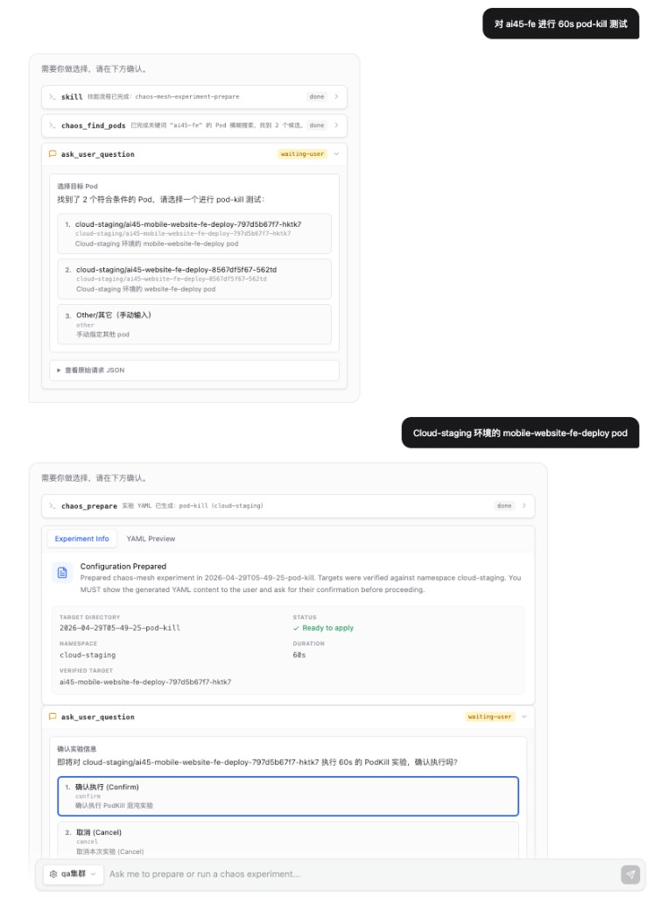

[English](README.md) | [中文](README_CN.md)

# Chaos Agent

Local conversational chaos engineering agent built on top of `vercel-labs/open-agents`, focused on Kubernetes chaos workflows.

## UI preview



## What this project does

- Provides a chat-first UI to prepare and execute chaos experiments end to end.
- Supports multiple chaos engines through a unified workflow.
- Stores cluster configs and chat history in local PostgreSQL.
- Uses cluster API access (`endpoint + token`) instead of local `kubectl` execution for chaos operations.

## Supported chaos engines

- **Chaos Mesh**: API-compatible with **Chaos Mesh v2.6.x - v2.8.x** (`chaos-mesh.org/v1alpha1`)
- **ChaosBlade (Kubernetes)**: API-compatible with **chaosblade-operator v1.7.x - v1.8.x** (`chaosblade.io/v1alpha1`)

## Repository layout

- `agent-core/` — core app and agent runtime (Next.js + tools + Prisma)
- `skills/` — chaos skills loaded by the agent
  - `chaos-mesh-experiment-prepare`
  - `chaos-mesh-experiment-execute`
  - `chaosblade-experiment-prepare`
  - `chaosblade-experiment-execute`
- `CHAOS_MESH_AGENT_GUIDE.md` — additional setup and workflow notes

## Quick start

1. Configure environment variables in `agent-core/apps/web/.env.local` (or root `.env.local`):
   - `LLM_API_KEY`
   - `LLM_API_URL`
   - `LLM_MODEL`
   - `LOCAL_DATABASE_URL`
2. Install dependencies from workspace root:

```bash
bun install
```

3. Sync Prisma schema:

```bash
cd agent-core/apps/web
bun run prisma:generate
bun run prisma:push
```

4. Start the web app:

```bash
cd agent-core/apps/web
bun run dev
```

5. Open `http://localhost:3000`, then configure cluster entries in UI:
   - `name`
   - `endpoint`
   - `token`

## Runtime configuration notes

- `CHAOS_ENGINE` can be `chaos-mesh` or `chaosblade-k8s`.
- The active cluster `endpoint` and `token` are loaded from DB by cluster name.
- If cluster endpoint is missing, Chaos Mesh tool calls fail fast with a clear message.

## Current behavior guarantees

- Single confirmation gate before execution in normal prepare/execute flow.
- Markdown rendering in assistant text output.
- Tool progress and execution status are shown with loading/status indicators.
- Ambiguous target selection uses structured options including manual input.

## References

- Core framework: [vercel-labs/open-agents](https://github.com/vercel-labs/open-agents)
- Chaos Mesh: [chaos-mesh/chaos-mesh](https://github.com/chaos-mesh/chaos-mesh)
- ChaosBlade Operator: [chaosblade-io/chaosblade-operator](https://github.com/chaosblade-io/chaosblade-operator)

